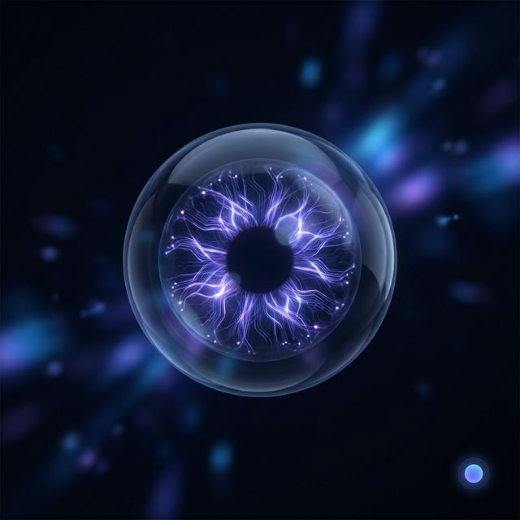

# Lumina Vision: Neural Narrative & Safety Assistant



## 🌟 Inspiration
The primary inspiration for **Lumina Vision** came from a simple question: *Can we use high-speed AI to narrate the visual world for those who cannot see it?* 

Current accessibility tools are often slow, robotic, or siloed into specific apps. We built a "Neural Link"—a seamless, high-performance assistant that doesn't just list objects, but describes the world with narrative depth, detects immediate physical hazards, and provides tactile feedback through haptics.

## 🚀 Features
- **Narrative Intelligence**: Uses GPT-4o Vision to provide rich, descriptive narratives of surroundings.
- **Safety Guardian**: Real-time hazard detection that classifies risks (Safe, Caution, DANGER) and triggers haptic (vibration) alerts.
- **Low-Latency Architecture**: Client-side image compression and streaming APIs ensure responses feel instantaneous.
- **Neural Personalization**: Toggle between "Professional" and "Warm" voice profiles to suit the user's environment.
- **Offline-First PWA**: Can be installed as a native app for a browser-free, immersive experience.

## 🛠 Built With
Lumina is built on a high-performance **Clean Architecture** for modern web apps:
- **Framework**: [Next.js](https://nextjs.org) with App Router.
- **AI Brain**: [OpenAI GPT-4o](https://openai.com) for vision analysis and real-time streaming.
- **Voice Synthesis**: OpenAI TTS-1 with dynamic voice profile switching.
- **UI/UX**: Custom "Neural Link" dark-mode aesthetic built with Tailwind CSS v4 and Lucide icons.
- **Sensory Hub**: Web Audio API for native sound effects and the Vibration API for haptic feedback.

## 📦 Getting Started

### Prerequisites
- Node.js 18+ 
- OpenAI API Key

### Installation
1. Clone the repository:
   ```bash
   git clone https://github.com/Alpha04-ash/lumina_vision.git
   ```
2. Install dependencies:
   ```bash
   npm install
   ```
3. Set up environment variables:
   Create a `.env.local` file and add your key:
   ```env
   OPENAI_API_KEY=your_key_here
   ```
4. Run the development server:
   ```bash
   npm run dev
   ```

## 🧠 What we learned
We learned that the difference between an "app" and an "assistant" is in the details—haptics, sound cues, and streaming responses aren't just "polish," they are the core experience for accessibility-focused software.

## 🔮 What's next
- **Object Tracking**: Active spatial tracking with stereo-audio to help users find specific items.
- **Multi-Modal Memory**: Remembering the layout of a room to provide "Spatial Navigation" instructions.
